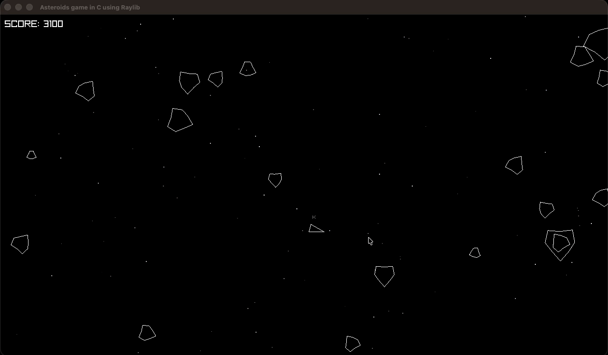
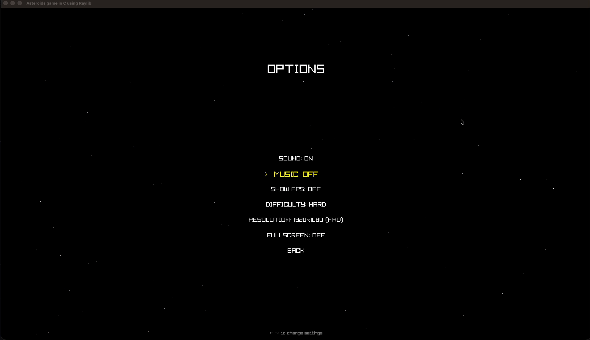
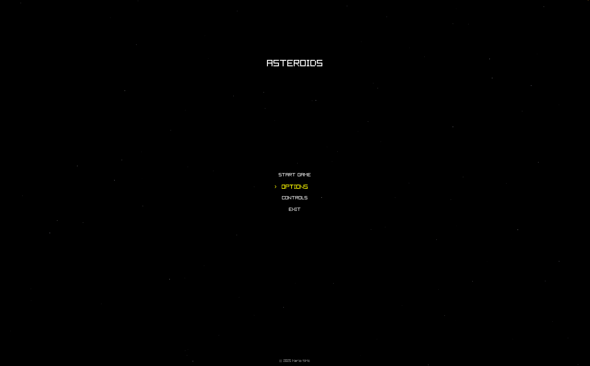
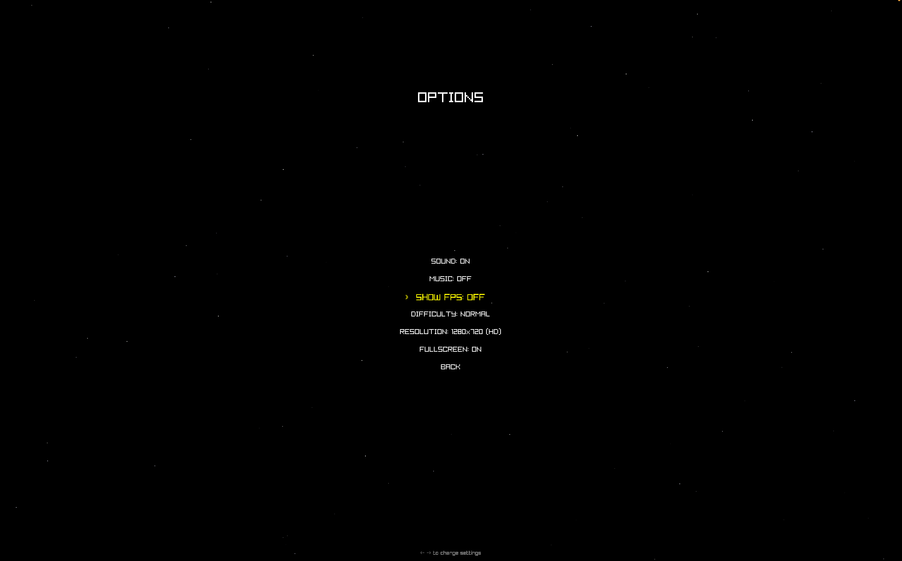
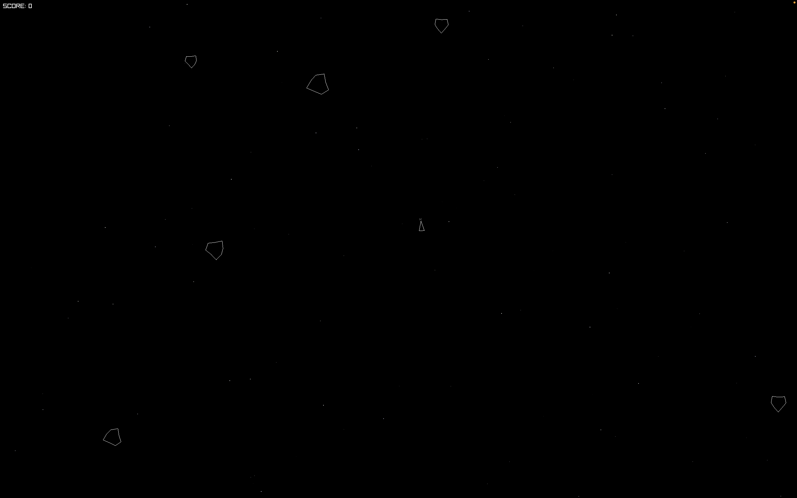

# Asteroids

A complete Asteroids arcade game written in pure C using Raylib.

---

## Overview

Built as a focused exercise in game loop architecture, real-time physics, and 2D collision detection. Every system — movement, collision, rendering, sound — is implemented directly without engine abstractions beyond Raylib's window, drawing, and audio APIs.

---

## Screenshots

### Gameplay





### Interface







---

## Features

### Gameplay
- Physics-based ship movement with thrust inertia and angular velocity damping
- Asteroid splitting mechanics: large asteroids break into faster-moving fragments
- Triple-shot spread projectile system with color-coded bullets
- Score tracking with persistent high score
- Parallax star background for depth effect

### Technical
- State machine architecture handling menu, gameplay, pause, and game over states
- Dual input system supporting both keyboard and mouse control schemes
- Full audio integration with sound effects and background music
- Resolution selection and fullscreen toggle support
- Clean separation between game logic update and render passes

---

## Controls

### Keyboard

| Key              | Action              |
|------------------|---------------------|
| W / Up Arrow     | Thrust              |
| A / Left Arrow   | Rotate left         |
| D / Right Arrow  | Rotate right        |
| Space            | Fire                |
| P                | Pause               |
| Escape           | Return to menu      |
| Enter            | Restart (game over) |
| F11              | Toggle fullscreen   |

### Mouse

| Input            | Action              |
|------------------|---------------------|
| Movement         | Aim ship            |
| Left Click       | Fire                |
| Right Click      | Thrust              |

---

## System Requirements

- **OS**: macOS, Linux, Windows
- **GPU**: Any OpenGL 3.3 compatible graphics
- **Dependencies**: Raylib 4.x

---

## Build Instructions

### macOS

```bash
brew install raylib
make
./bin/asteroids
```

### Linux (Debian/Ubuntu)

```bash
sudo apt install libraylib-dev
make
./bin/asteroids
```

### Linux (Arch)

```bash
sudo pacman -S raylib
make
./bin/asteroids
```

### Build Targets

```bash
make          # Build the project
make clean    # Remove build artifacts
```

---

## Project Structure

```
Asteroids/
├── src/
│   ├── main.c           # Entry point and main loop
│   ├── game.c           # Game state management
│   ├── player.c         # Ship physics and input handling
│   ├── asteroid.c       # Asteroid spawning and splitting
│   ├── bullet.c         # Projectile system
│   ├── menu.c           # Menu state handlers
│   ├── resolution.c     # Display configuration
│   ├── sound.c          # Audio management
│   ├── stars.c          # Background rendering
│   └── utils.c          # Utility functions
├── include/             # Header files
├── Resources/
│   ├── sounds/          # Sound effects (.wav)
│   └── music/           # Background music (.mp3)
├── Makefile
└── LICENSE
```

---

## Architecture

The game follows a state machine pattern with a straightforward game loop:

```
main()
└── Game Loop
    ├── UpdateGame()
    │   ├── UpdateMainMenu() / UpdateOptionsMenu() / UpdatePauseMenu()
    │   ├── UpdatePlayer()
    │   │   ├── UpdatePlayerKeyboard()
    │   │   └── UpdatePlayerMouse()
    │   ├── UpdateAsteroid()
    │   ├── UpdateBullets()
    │   ├── UpdateStars()
    │   └── CheckCollisions()
    └── DrawGame()
        ├── DrawStars()
        ├── DrawPlayer()
        ├── DrawAsteroids()
        ├── DrawBullets()
        └── DrawHUD / DrawMenu()
```

Game states: `MAIN_MENU` | `GAMEPLAY` | `PAUSED` | `GAME_OVER` | `OPTIONS_MENU` | `CONTROLS_MENU`

---

## Status

Complete and fully playable. No major features planned.

---

## License

MIT License. See [LICENSE](LICENSE) for details.
